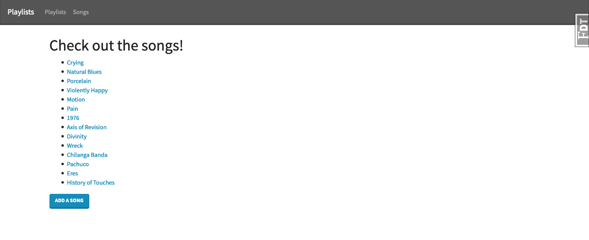
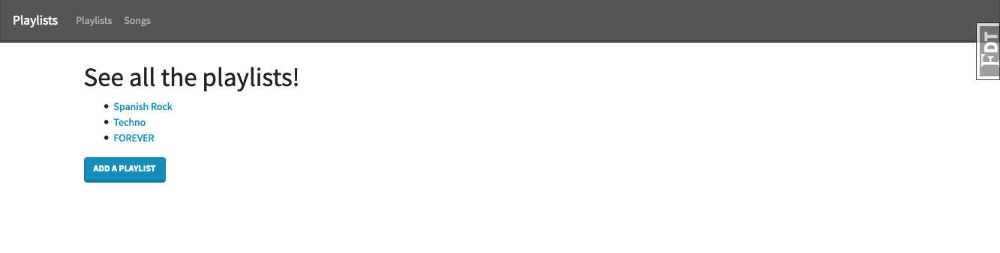
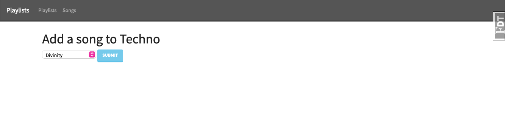

> This application allows a user to create songs and playlists and add a song to a playlist. The data model will allow for many songs to be part of many different playlists and allow for many different playlists to include many different songs.

#### Technologies used in the project:
- Flask
- WTForms
- PostgreSQL

